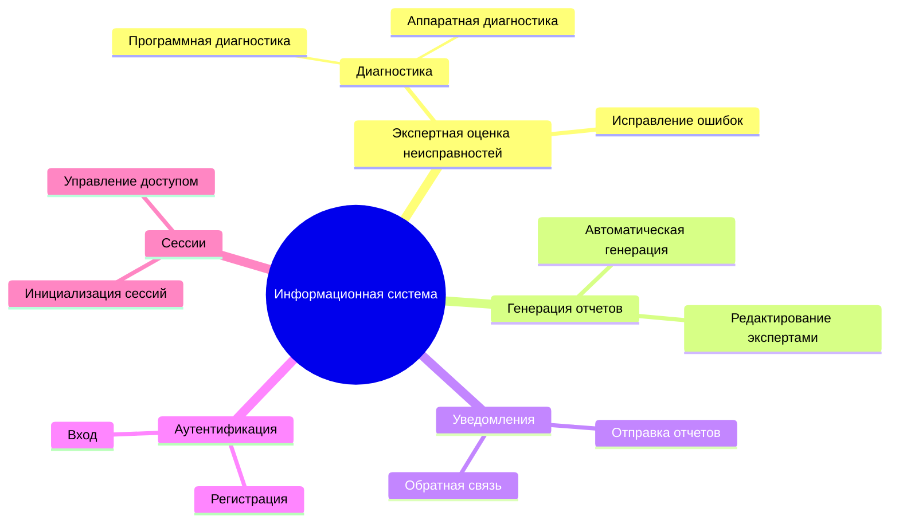
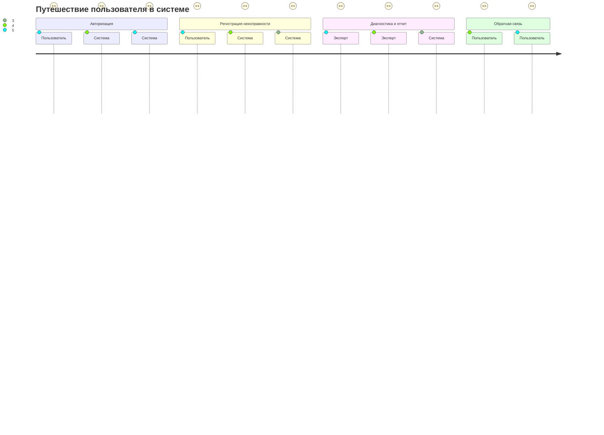
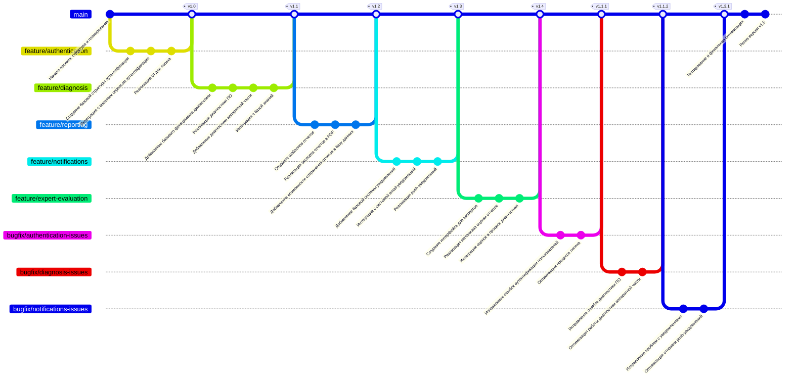

# Mind Map

```mermaid
mindmap
  root((Информационная система))
    Экспертная оценка неисправностей
      Диагностика
        Программная диагностика
        Аппаратная диагностика
      Исправление ошибок
    Генерация отчетов
      Автоматическая генерация
      Редактирование экспертами
    Уведомления
      Отправка отчетов
      Обратная связь
    Аутентификация
      Регистрация
      Вход
    Сессии
      Инициализация сессий
      Управление доступом
```

# Journey

```mermaid
journey
  title Путешествие пользователя в системе
  section Авторизация
    Пользователь: Вход в систему: 5: Успешно
    Система: Проверка данных: 4: Успешно
    Система: Создание сессии: 5: Успешно
  section Регистрация неисправности
    Пользователь: Регистрация проблемы: 5: Легко
    Система: Создание задачи: 4: Автоматизировано
    Система: Уведомление эксперта: 3: Прямо
  section Диагностика и отчет
    Эксперт: Диагностика: 5: Удобно
    Эксперт: Редактирование отчета: 4: Гибко
    Система: Генерация уведомлений: 3: Автоматизировано
  section Обратная связь
    Пользователь: Получение уведомления: 4: Быстро
    Пользователь: Подтверждение завершения: 5: Удобно
```

# QuadrantChart

```mermaid
gitGraph
  commit id: "Начало проекта: структура и планирование"
  
  branch feature/authentication
  commit id: "Создание базовой структуры аутентификации"
  commit id: "Интеграция с внешним сервисом аутентификации"
  commit id: "Реализация UI для логина"
  checkout main
  merge feature/authentication tag: "v1.0"
  
  branch feature/diagnosis
  commit id: "Добавление базового функционала диагностики"
  commit id: "Реализация диагностики ПО"
  commit id: "Добавление диагностики аппаратной части"
  commit id: "Интеграция с базой знаний"
  checkout main
  merge feature/diagnosis tag: "v1.1"
  
  branch feature/reporting
  commit id: "Создание шаблонов отчетов"
  commit id: "Реализация экспорта отчетов в PDF"
  commit id: "Добавление возможности сохранения отчетов в базу данных"
  checkout main
  merge feature/reporting tag: "v1.2"
  
  branch feature/notifications
  commit id: "Добавление базовой системы уведомлений"
  commit id: "Интеграция с системой email-уведомлений"
  commit id: "Реализация push-уведомлений"
  checkout main
  merge feature/notifications tag: "v1.3"
  
  branch feature/expert-evaluation
  commit id: "Создание интерфейса для экспертов"
  commit id: "Реализация механизма оценки отчетов"
  commit id: "Интеграция оценок в процесс диагностики"
  checkout main
  merge feature/expert-evaluation tag: "v1.4"
  
  branch bugfix/authentication-issues
  commit id: "Исправление ошибок аутентификации пользователей"
  commit id: "Оптимизация процесса логина"
  checkout main
  merge bugfix/authentication-issues tag: "v1.1.1"
  
  branch bugfix/diagnosis-issues
  commit id: "Исправление ошибок диагностики ПО"
  commit id: "Оптимизация работы диагностики аппаратной части"
  checkout main
  merge bugfix/diagnosis-issues tag: "v1.1.2"
  
  branch bugfix/notifications-issues
  commit id: "Исправление проблем с уведомлениями"
  commit id: "Оптимизация отправки push-уведомлений"
  checkout main
  merge bugfix/notifications-issues tag: "v1.3.1"
  
  commit id: "Тестирование и финальная оптимизация"
  commit id: "Релиз версии v1.5"

```

# GitGraph

```mermaid
gitGraph
  commit id: "Начало проекта: структура и планирование"
  
  branch feature/authentication
  commit id: "Создание базовой структуры аутентификации"
  commit id: "Интеграция с внешним сервисом аутентификации"
  commit id: "Реализация UI для логина"
  checkout main
  merge feature/authentication tag: "v1.0"
  
  branch feature/diagnosis
  commit id: "Добавление базового функционала диагностики"
  commit id: "Реализация диагностики ПО"
  commit id: "Добавление диагностики аппаратной части"
  commit id: "Интеграция с базой знаний"
  checkout main
  merge feature/diagnosis tag: "v1.1"
  
  branch feature/reporting
  commit id: "Создание шаблонов отчетов"
  commit id: "Реализация экспорта отчетов в PDF"
  commit id: "Добавление возможности сохранения отчетов в базу данных"
  checkout main
  merge feature/reporting tag: "v1.2"
  
  branch feature/notifications
  commit id: "Добавление базовой системы уведомлений"
  commit id: "Интеграция с системой email-уведомлений"
  commit id: "Реализация push-уведомлений"
  checkout main
  merge feature/notifications tag: "v1.3"
  
  branch feature/expert-evaluation
  commit id: "Создание интерфейса для экспертов"
  commit id: "Реализация механизма оценки отчетов"
  commit id: "Интеграция оценок в процесс диагностики"
  checkout main
  merge feature/expert-evaluation tag: "v1.4"
  
  branch bugfix/authentication-issues
  commit id: "Исправление ошибок аутентификации пользователей"
  commit id: "Оптимизация процесса логина"
  checkout main
  merge bugfix/authentication-issues tag: "v1.1.1"
  
  branch bugfix/diagnosis-issues
  commit id: "Исправление ошибок диагностики ПО"
  commit id: "Оптимизация работы диагностики аппаратной части"
  checkout main
  merge bugfix/diagnosis-issues tag: "v1.1.2"
  
  branch bugfix/notifications-issues
  commit id: "Исправление проблем с уведомлениями"
  commit id: "Оптимизация отправки push-уведомлений"
  checkout main
  merge bugfix/notifications-issues tag: "v1.3.1"
  
  commit id: "Тестирование и финальная оптимизация"
  commit id: "Релиз версии v1.5"

```
