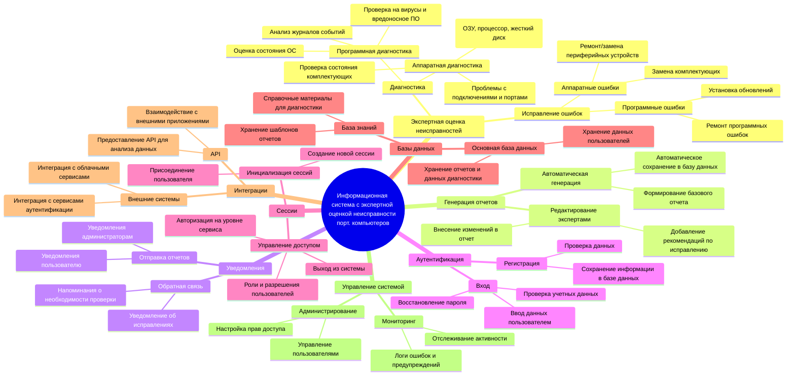
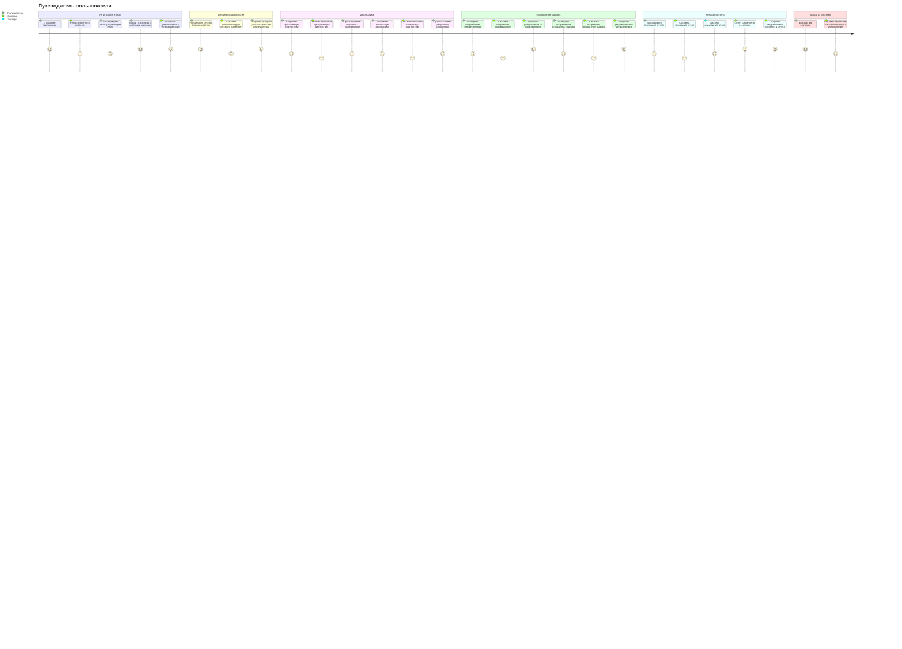
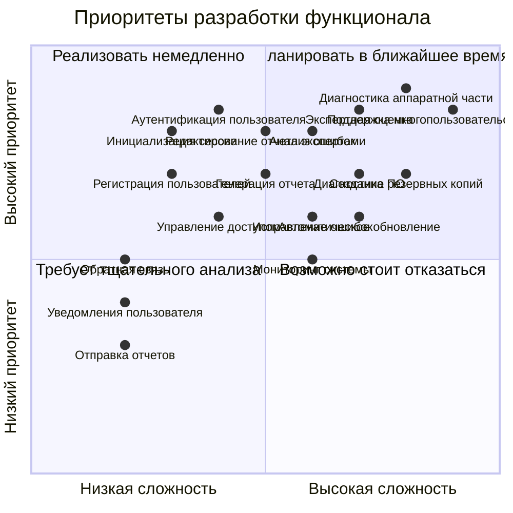
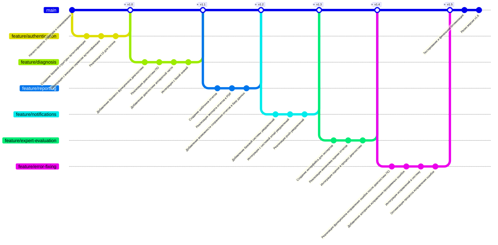

# Mind Map

```mermaid
mindmap
  root((Информационная система с экспертной оценкой неисправности порт. компьютеров))
    Экспертная оценка неисправностей
      Диагностика
        Программная диагностика
          Оценка состояния ОС
          Проверка на вирусы и вредоносное ПО
          Анализ журналов событий
        Аппаратная диагностика
          Проверка состояния комплектующих
          Тестирование компонентов (ОЗУ, процессор, жесткий диск)
          Проблемы с подключениями и портами
      Исправление ошибок
        Программные ошибки
          Ремонт программных ошибок
          Установка обновлений
        Аппаратные ошибки
          Замена комплектующих
          Ремонт/замена периферийных устройств
    Генерация отчетов
      Автоматическая генерация
        Формирование базового отчета
        Автоматическое сохранение в базу данных
      Редактирование экспертами
        Внесение изменений в отчет
        Добавление рекомендаций по исправлению
    Уведомления
      Отправка отчетов
        Уведомления пользователю
        Уведомления администраторам
      Обратная связь
        Уведомление об исправлениях
        Напоминания о необходимости проверки
    Аутентификация
      Регистрация
        Проверка данных
        Сохранение информации в базе данных
      Вход
        Ввод данных пользователем
        Проверка учетных данных
        Восстановление пароля
    Сессии
      Инициализация сессий
        Создание новой сессии
        Присоединение пользователя
      Управление доступом
        Роли и разрешения пользователей
        Авторизация на уровне сервиса
        Выход из системы
    Базы данных
      Основная база данных
        Хранение данных пользователей
        Хранение отчетов и данных диагностики
      База знаний
        Хранение шаблонов отчетов
        Справочные материалы для диагностики
    Интеграции
      Внешние системы
        Интеграция с облачными сервисами
        Интеграция с сервисами аутентификации
      API
        Взаимодействие с внешними приложениями
        Предоставление API для анализа данных
    Управление системой
      Администрирование
        Управление пользователями
        Настройка прав доступа
      Мониторинг
        Отслеживание активности
        Логи ошибок и предупреждений

```

# Journey

```mermaid
journey
    title Путеводитель пользователя
    section Регистрация и вход
      Открывает приложение: 5: Пользователь
      Регистрируется в системе: 4: Система
      Подтверждает регистрацию через email: 4: Пользователь
      Входит в систему с учетными данными: 5: Пользователь
      Получает уведомление о успешном входе: 5: Система

    section Инициализация сессии
      Инициирует сессию для диагностики: 5: Пользователь
      Система инициализирует сессию и проверяет доступ: 4: Система
      Получает доступ к диагностическим инструментам: 5: Пользователь

    section Диагностика
      Запускает программную диагностику: 4: Пользователь
      Система выполняет программную диагностику: 3: Система
      Просматривает результаты программной диагностики: 4: Пользователь
      Запускает аппаратную диагностику: 4: Пользователь
      Система выполняет аппаратную диагностику: 3: Система
      Просматривает результаты аппаратной диагностики: 4: Пользователь

    section Исправление ошибок
      Выбирает исправление обнаруженных ошибок: 4: Пользователь
      Система исправляет программные ошибки: 3: Система
      Получает уведомление об исправлениях: 5: Система
      Выбирает исправление аппаратных ошибок: 4: Пользователь
      Система исправляет аппаратные ошибки: 3: Система
      Получает уведомление об исправлениях: 5: Система

    section Генерация отчета
      Запрашивает генерацию отчета: 4: Пользователь
      Система генерирует отчет: 3: Система
      Эксперт редактирует отчет: 4: Эксперт
      Отчет сохраняется в системе: 5: Система
      Получает уведомление о готовности отчета: 5: Система

    section Выход из системы
      Выходит из системы: 5: Пользователь
      Система завершает сессию и выводит уведомление: 4: Система

```

# Quadrant Chart

```mermaid
quadrantChart
    title Приоритеты разработки функционала
    x-axis "Низкая сложность" --> "Высокая сложность"
    y-axis "Низкий приоритет" --> "Высокий приоритет"
    quadrant-1 "Планировать в ближайшее время"
    quadrant-2 "Реализовать немедленно"
    quadrant-3 "Требует тщательного анализа"
    quadrant-4 "Возможно стоит отказаться"
    "Инициализация сессии": [0.3, 0.8]
    "Аутентификация пользователя": [0.4, 0.85]
    "Диагностика ПО": [0.7, 0.7]
    "Диагностика аппаратной части": [0.8, 0.9]
    "Исправление ошибок": [0.6, 0.6]
    "Генерация отчета": [0.5, 0.7]
    "Уведомления пользователя": [0.2, 0.4]
    "Экспертная оценка": [0.7, 0.85]
    "Отправка отчетов": [0.2, 0.3]
    "Редактирование отчета экспертами": [0.5, 0.8]
    "Управление доступом": [0.4, 0.6]
    "Регистрация пользователей": [0.3, 0.7]
    "Мониторинг системы": [0.6, 0.5]
    "Обратная связь": [0.2, 0.5]
    "Автоматическое обновление": [0.7, 0.6]
    "Создание резервных копий": [0.8, 0.7]
    "Анализ ошибок": [0.6, 0.8]
    "Поддержка многопользовательского режима": [0.9, 0.85]
```

# Git Graph

```mermaid
gitGraph
  commit id: "Начало проекта: структура и планирование"
  
  branch feature/authentication
  commit id: "Создание базовой структуры аутентификации"
  commit id: "Интеграция с внешним сервисом аутентификации"
  commit id: "Реализация UI для логина"
  checkout main
  merge feature/authentication tag: "v1.0"
  
  branch feature/diagnosis
  commit id: "Добавление базового функционала диагностики"
  commit id: "Реализация диагностики ПО"
  commit id: "Добавление диагностики аппаратной части"
  commit id: "Интеграция с базой знаний"
  checkout main
  merge feature/diagnosis tag: "v1.1"
  
  branch feature/reporting
  commit id: "Создание шаблонов отчетов"
  commit id: "Реализация экспорта отчетов в PDF"
  commit id: "Добавление возможности сохранения отчетов в базу данных"
  checkout main
  merge feature/reporting tag: "v1.2"
  
  branch feature/notifications
  commit id: "Добавление базовой системы уведомлений"
  commit id: "Интеграция с системой email-уведомлений"
  commit id: "Реализация push-уведомлений"
  checkout main
  merge feature/notifications tag: "v1.3"
  
  branch feature/expert-evaluation
  commit id: "Создание интерфейса для экспертов"
  commit id: "Реализация механизма оценки отчетов"
  commit id: "Интеграция оценок в процесс диагностики"
  checkout main
  merge feature/expert-evaluation tag: "v1.4"
  
  branch feature/error-fixing
  commit id: "Реализация функционала исправления ошибок после диагностики ПО"
  commit id: "Добавление алгоритма исправления программных ошибок"
  commit id: "Интеграция исправлений в систему"
  commit id: "Оптимизация процесса исправления ошибок"
  checkout main
  merge feature/error-fixing tag: "v1.5"
  
  commit id: "Тестирование и финальная оптимизация"
  commit id: "Релиз версии v1.6"


```
