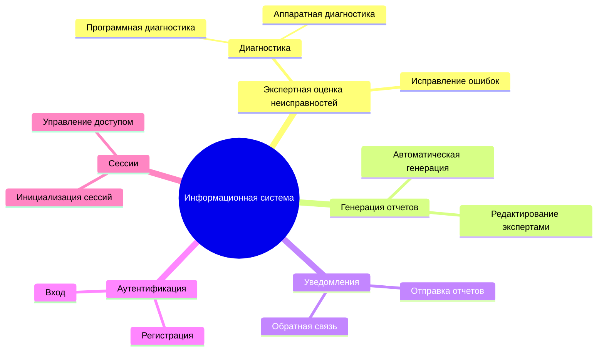
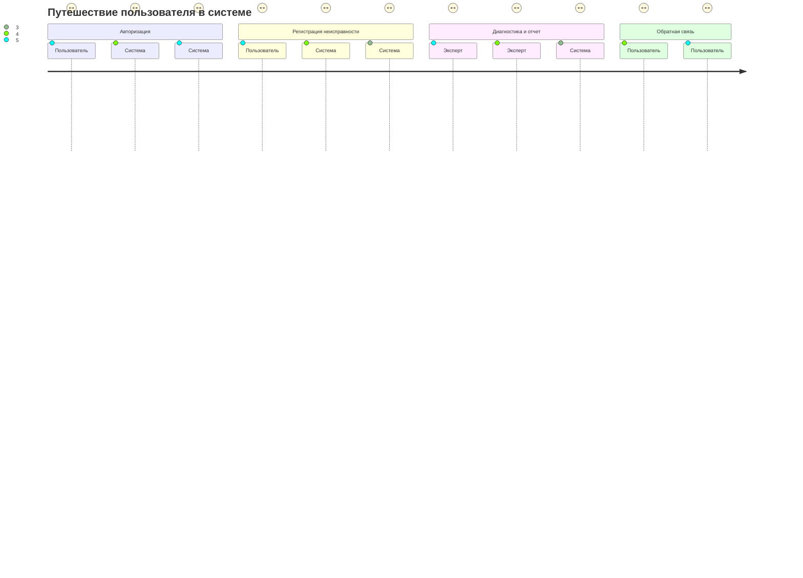
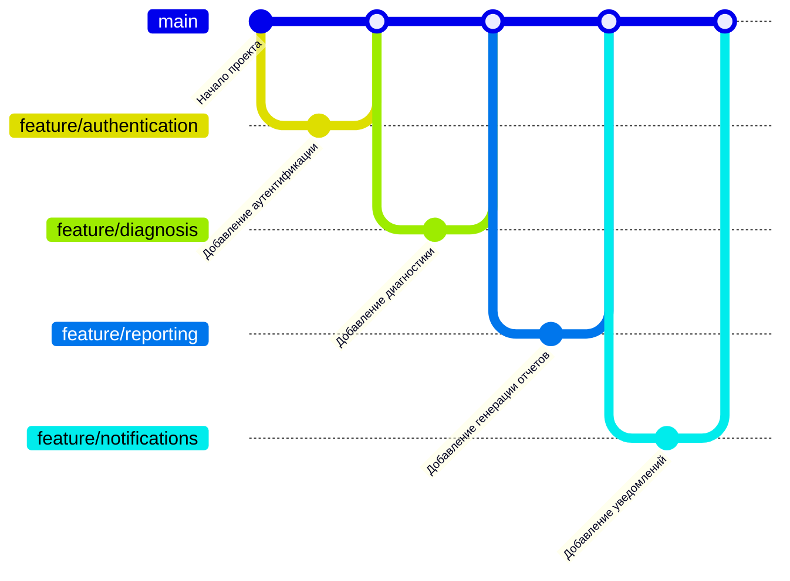

# Mind Map






```mermaid
quadrantChart
  title Приоритет задач
  x-axis Сложность
  y-axis Важность
  "Высокий приоритет, низкая сложность" [1, 4]: Инициализация сессии
  "Высокий приоритет, высокая сложность" [3, 4]: Диагностика
  "Низкий приоритет, низкая сложность" [1, 1]: Уведомления
  "Низкий приоритет, высокая сложность" [3, 1]: Исправление ошибок
```



