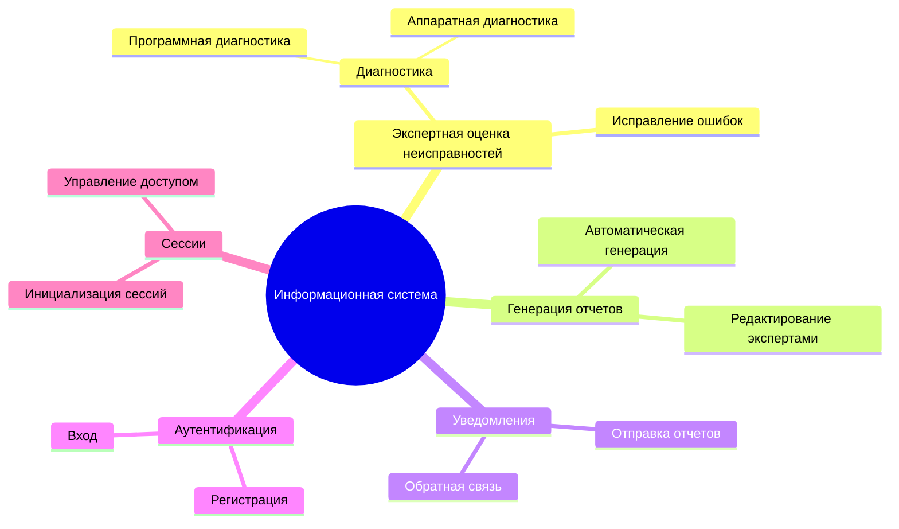
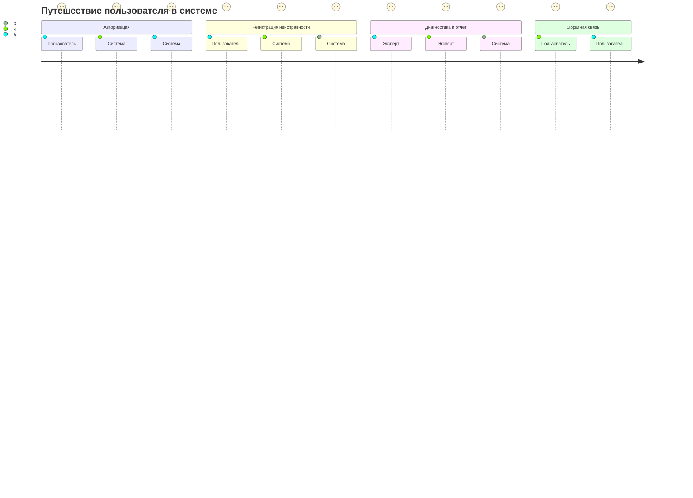
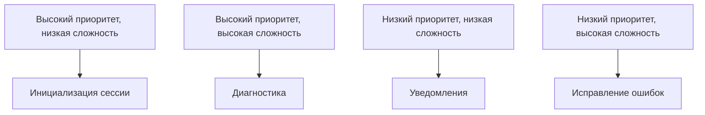
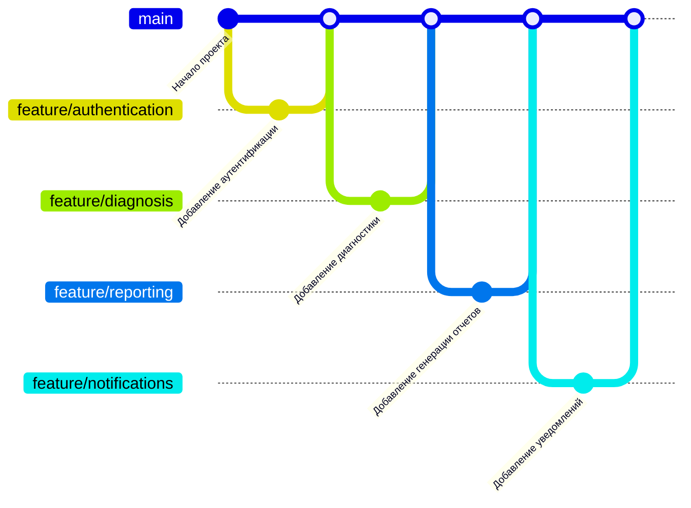

# Mind Map

```mermaid
mindmap
  root((Информационная система))
    Экспертная оценка неисправностей
      Диагностика
        Программная диагностика
        Аппаратная диагностика
      Исправление ошибок
    Генерация отчетов
      Автоматическая генерация
      Редактирование экспертами
    Уведомления
      Отправка отчетов
      Обратная связь
    Аутентификация
      Регистрация
      Вход
    Сессии
      Инициализация сессий
      Управление доступом
```

```mermaid
journey
  title Путешествие пользователя в системе
  section Авторизация
    Пользователь: Вход в систему: 5: Успешно
    Система: Проверка данных: 4: Успешно
    Система: Создание сессии: 5: Успешно
  section Регистрация неисправности
    Пользователь: Регистрация проблемы: 5: Легко
    Система: Создание задачи: 4: Автоматизировано
    Система: Уведомление эксперта: 3: Прямо
  section Диагностика и отчет
    Эксперт: Диагностика: 5: Удобно
    Эксперт: Редактирование отчета: 4: Гибко
    Система: Генерация уведомлений: 3: Автоматизировано
  section Обратная связь
    Пользователь: Получение уведомления: 4: Быстро
    Пользователь: Подтверждение завершения: 5: Удобно
```

```mermaid
flowchart TB
    A[Высокий приоритет, низкая сложность] --> B[Инициализация сессии]
    C[Высокий приоритет, высокая сложность] --> D[Диагностика]
    E[Низкий приоритет, низкая сложность] --> F[Уведомления]
    G[Низкий приоритет, высокая сложность] --> H[Исправление ошибок]
```

```mermaid
  gitGraph
  commit id: "Начало проекта"
  branch feature/authentication
  commit id: "Добавление аутентификации"
  checkout main
  merge feature/authentication

  branch feature/diagnosis
  commit id: "Добавление диагностики"
  checkout main
  merge feature/diagnosis

  branch feature/reporting
  commit id: "Добавление генерации отчетов"
  checkout main
  merge feature/reporting

  branch feature/notifications
  commit id: "Добавление уведомлений"
  checkout main
  merge feature/notifications
```
